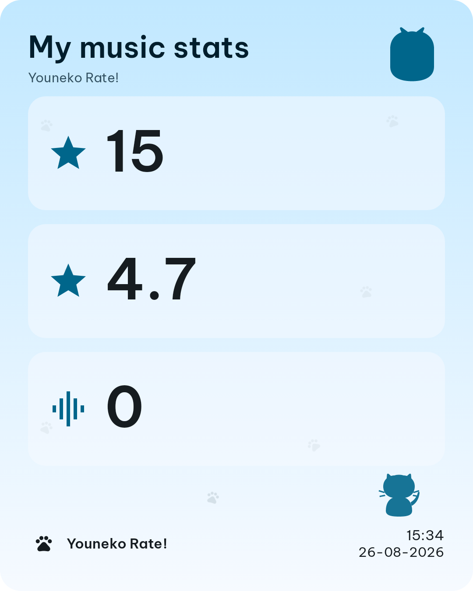

<p align="center">
  
</p>

# Youneko Rate! 🐾

> A small Android app for rating albums and tracks, writing reviews, reading local credits and lyrics, and inspecting audio quality.

[Đọc README tiếng Việt](README.vi.md)

[](https://developer.android.com/)
[](app/build.gradle.kts)
[](gradle/libs.versions.toml)
[](LICENSE)

Youneko Rate! is a personal, offline-first companion for people who like to keep thoughtful album notes. It reads the local audio library, stores ratings and reviews in Room, and provides analysis and organization tools without becoming another music player.

## ✨ Features


The four main tabs are real parts of the current app:

| Tab | What it does |
|---|---|
| **Library** | Scans MediaStore and optional SAF folders in two phases, with a visible progress banner. It discovers local metadata and then enriches artwork without fetching covers during the scan. |
| **Rate** | Lets you rate tracks manually, review albums and tracks, manage tags and listening logs, and see album gradients generated from Palette data. |
| **Analyze** | Decodes audio for inspection only. The STFT/FFT analysis reports codec, bitrate, sample rate, bit depth and spectral indicators when available, then shows a heuristic codec-quality verdict. |
| **Stats** | Summarizes saved ratings and analyses, shows distributions and rankings, and can render a 1080×1350 share image with a preview, share action and local save action. |

The app also includes local credits and lyrics readers, collections, advanced search and an artist page. For cover art, **Find cover** uses a two-step flow: open the COV website in the external browser for the user to search and download an image, then choose that image from the Android gallery. The app does not call the private COV API. Backup export/import uses a `.younekorate` ZIP with database, covers, settings and JSON/CSV data. English and Vietnamese resources are provided, with Material 3 / Material You theming, a paw launcher icon and splash screen.

## 📸 Screenshots

The repository is still in beta and does not include fabricated device screenshots. The four cells below are deliberate placeholders for future screenshots.

| Library | Rate |
|---|---|
| <!--  --> <!-- TODO: add a real device screenshot --> | <!--  --> <!-- TODO: add a real device screenshot --> |

| Album detail | Stats |
|---|---|
| <!--  --> <!-- TODO: add a real device screenshot --> | <!--  --> <!-- TODO: add a real device screenshot --> |

## 🛠️ Technology and architecture

The versions below are read from `gradle/libs.versions.toml` and `app/build.gradle.kts` rather than guessed from the UI.

| Area | Actual dependency or implementation |
|---|---|
| Language and UI | Kotlin `2.4.10`, Jetpack Compose, Compose BOM `2026.08.00`, Material 3 |
| Android build | Android Gradle Plugin `9.3.1`, Gradle wrapper `9.5.0`, compile SDK `37`, min SDK `26`, target SDK `36` |
| Local data | Room `2.8.4` with KSP and exported schemas; DataStore Preferences `1.2.1` |
| Dependency injection | Hilt `2.60.1` and Hilt Navigation Compose `1.4.0` |
| Background work | WorkManager `2.11.2`; scan, analysis and backup tasks run in workers where appropriate |
| Networking and JSON | Retrofit `2.11.0`, OkHttp `4.12.0`, kotlinx.serialization JSON `1.11.0` |
| Images and artwork | Coil `2.7.0`, AndroidX Palette `1.0.0`, AndroidX ExifInterface `1.3.7` |
| Audio and tags | MediaExtractor, MediaCodec, MediaMetadataRetriever, jaudiotagger `3.0.1`, JTransforms `3.1` |
| Platform support | core-ktx `1.19.0`, core-splashscreen `1.0.1`, Activity Compose `1.13.0`, Navigation Compose `2.9.8` |

The code follows a practical MVVM and repository/data-layer structure. Compose screens observe `StateFlow` from ViewModels; DAOs provide Room data, Hilt supplies dependencies, DataStore stores preferences and scan state, and WorkManager handles longer operations. It is intentionally not presented as a perfectly separated Clean Architecture implementation.

## 📱 Requirements

The project currently pins the following Android build targets:

| Setting | Value |
|---|---:|
| `minSdk` | 26 |
| `targetSdk` | 36 |
| `compileSdk` | 37 |
| Java/JDK | 17 |
| Kotlin | 2.4.10 |

## 🚀 Build from source

```bash
git clone https://github.com/dungzual201/youneko-rate.git
cd youneko-rate
cp local.properties.example local.properties
# Set sdk.dir if Android Studio does not find your SDK automatically.
./gradlew assembleDebug
```

The debug APK is written to:

```text
app/build/outputs/apk/debug/app-debug.apk
```

A full local verification can also run:

```bash
./gradlew assembleDebug testDebugUnitTest lintDebug compileDebugAndroidTestKotlin
```

## 🔐 Permissions

| Permission | Why the app requests it |
|---|---|
| `READ_MEDIA_AUDIO` on Android 13+ | Read audio metadata from MediaStore. |
| `READ_EXTERNAL_STORAGE` on Android 12 and older | Read the equivalent local audio library on older Android versions. |
| `INTERNET` | Access the explicitly enabled online metadata and credits providers when the user asks for them. |
| `FOREGROUND_SERVICE` and `FOREGROUND_SERVICE_DATA_SYNC` | Keep long-running scans and backup/data-sync workers visible with a notification. |

The app does not request `MANAGE_EXTERNAL_STORAGE`.

## 📂 Project structure

```text
app/src/main/java/com/youneko/rate/
├── data/          # Room entities/DAOs, repositories, import, scan, artwork and workers
├── di/            # Hilt and HTTP/database dependency wiring
├── navigation/    # Compose navigation graph and routes
├── ui/
│   ├── analyze/   # Decode-only audio analysis and spectrogram UI
│   ├── artwork/   # Cover display, palette and cache-aware image loading
│   ├── components/ # Shared Material 3 components and design tokens
│   ├── coversearch/ # External COV browser and gallery import flow
│   ├── export/    # Backup/export/restore screens
│   ├── importer/  # Local audio import preview and save flow
│   ├── phase12/   # Collections, advanced search and artist page
│   ├── rate/      # Library, Rate, album detail, settings and editors
│   └── stats/     # Statistics and share-card rendering
└── res/           # Bilingual strings, themes, launcher/splash and vector assets
```

## ⚠️ Boundaries and data safety

Youneko Rate! is **not a music player**. There is no playback flow, no audio output, no lyric crawling and no original audio tag writing. Audio is decoded only for metadata and analysis. A missing source file is marked `isMissing` rather than deleting its rating, review or manual credit.

Imported artwork is stored privately under `filesDir/covers/`; it is not written back into the original audio file. Backups do not include audio files or provider tokens. Database migrations are explicit; the project does not use `fallbackToDestructiveMigration()`.

## 🌐 External data sources

Online providers are used only when the corresponding feature is requested. Credits and metadata providers are configured in the app, while COV is opened as an external website so the user can search and download the image themselves. The app does not call COV `/api/*`, use a WebView, proxy requests or spoof headers. Please respect each provider's terms and rate limits.

## 🐾 Thanks and disclaimer

Thanks to the open-source Android ecosystem and to the COV project for the public website that users can open in their browser. This is a personal beta project: behavior, provider availability and UI details may change.

<p align="center">
  
</p>

<p align="center"><sub>Made with 🐾 and too much coffee.</sub></p>

The project is released under the [MIT License](LICENSE).
